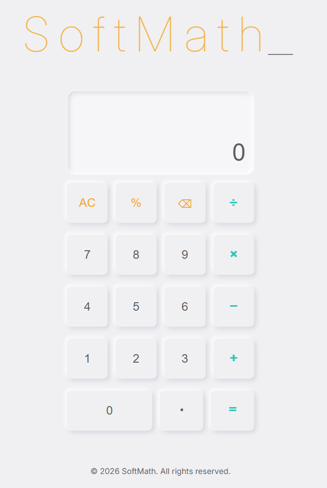

## SoftMath Calculator

🧮 Glassmorphic Neumorphism Calculator
A minimalist, high-fidelity calculator built with Vanilla JavaScript and BEM-structured HTML. This project focuses on the intersection of modern UI trends—combining the "frosted glass" look of glassmorphism with the soft, physical feel of neumorphism.

## Live Demo

🔗 [Live Site](https://kanbantaskmangement.netlify.app/) · [GitHub Repo](https://github.com/MoSu1248/Kanban-task-management)

## ✨ Features
-Responsive Design: Fully functional and visually consistent across devices.
-BEM Architecture: Scalable and maintainable CSS using the Block-Element-Modifier methodology.
-Premium Typography: Utilizing the Inter Variable Font for maximum legibility and a high-end tech feel.
-Clean Logic: Built with event delegation and a modular "operate" function.

## 🛠️ Tech Stack
HTML5 (Semantic & BEM)
CSS3 (Glassmorphism, Flexbox, Variable Fonts)
JavaScript (ES6+, DOM Manipulation)

## Author

Mohammed Suhail Rahman · [Portfolio](https://mscreatdev.netlify.app/) · [GitHub](https://github.com/MoSu1248)
